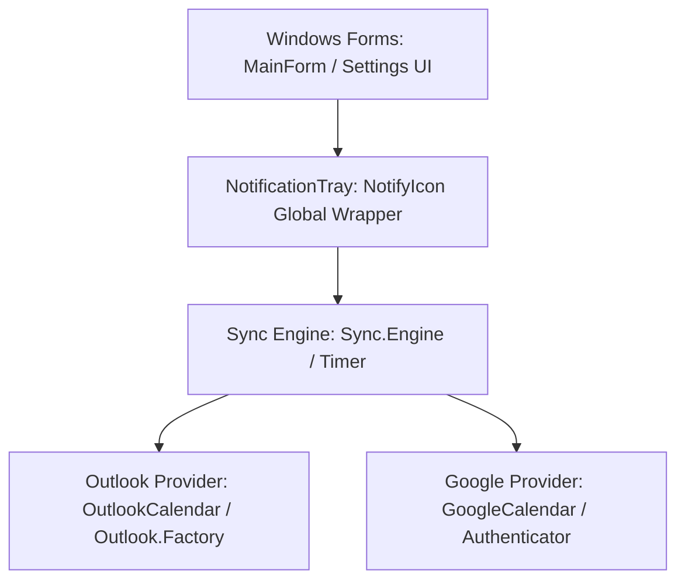

# Architecture Overview - Outlook Google Calendar Sync (OGCS)

Outlook Google Calendar Sync is a lightweight, background C# Windows Forms utility designed to sync calendar events bidirectionally or unidirectionally between Microsoft Outlook and Google Calendar.

## Core System Components

### 1. UI Layer (WinForms)
- **MainForm**: Provides the tabbed user interface for settings (sync options, outlook setup, google setup, calendar selection, and application options) and the sync log.
- **NotificationTray**: A single, global wrapper around the Windows `NotifyIcon` (System Tray Icon). Handles context menus, tooltips, and balloon notifications cleanly while avoiding leak issues common in multi-threaded UI/tray environments.

### 2. Sync Engine (`Sync/Engine.cs`)
- Orchestrates the synchronization process based on the configured sync direction (`OutlookToGoogle`, `GoogleToOutlook`, or `Bidirectional`).
- Manages sync timers, custom attributes mapping, date range calculation, and conflict resolution rules.
- Executes on background threads to prevent UI blockages.

### 3. Outlook Provider (`Outlook/` & `Outlook.Factory/`)
- Interacts with local Microsoft Outlook installations.
- Leverages Outlook Interop or Microsoft Graph APIs depending on the configuration.
- Abstracts recurrence parsing and customized category/color mappings.

### 4. Google Calendar Provider (`Google/` and `Google.Graph/`)
- Interfaces with the Google Calendar API (v3) using OAuth2 credentials.
- Handles authorization, token refresh, attendee registration, and meet links.
- Uses `Google.Apis.Calendar.v3` client libraries.
