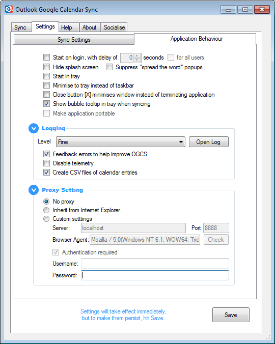
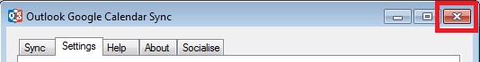



# Application Behaviour

**Start on login:** Set OGCS to start up when you log in to Windows. 

<b>Delay:</b> On system’s that take a little while to get started, OGCS can encounter problems if starts too quickly - especially if Outlook is also set to start on startup. If OGCS only seems to have problems on system startup, try setting a delay.

**Hide splash screen:** If you have donated £10 or more, you have the option of stopping the startup splash screen from displaying.  
**Start in tray:** Instead of showing the application window on startup, set it to only display in the Windows notification tray are  a. From here you can control the syncs or show the application by right clicking the icon.  
**Minimise to tray:** By default, OGCS will have an application icon in the main taskbar area. This option will make it only display an icon in the notification area instead.  

**Close button minimises:** Prevent the application from closing when clicking on the standard top right “close” button. Instead it will simply minimise.   
**Show bubble tooltip in tray when syncing:** Get notifications when a sync begins and a summary of the changes on completion.  
**Make application portable:** Only available, but enabled by default, if the portable ZIP application is being used.  
**Create CSV files of calendar entries:** This can be turned on to aid investigation of a possible problem, usually under instruction having raised a [GitHub Issue](https://github.com/phw198/OutlookGoogleCalendarSync/issues).  

### Logging
**Logging level:** Set the level of detail captured in the log file. From `OFF` through to `ALL`, with `DEBUG` being the default. Ensure it is set to `DEBUG` or greater if attaching it to a [GitHub Issue](https://github.com/phw198/OutlookGoogleCalendarSync/issues).

## Proxy Settings
**No Proxy:** When there is a direct connection to the internet, for example, using home broadband.
Inherit from Internet Explorer: Use the same settings as configured in Internet Explorer. Normally the best option if connecting through a corporate proxy, or use a PAC file etc.  
**Custom Settings:** Manually enter the proxy server and port, plus your proxy credentials if required.

&nbsp;



&nbsp;

