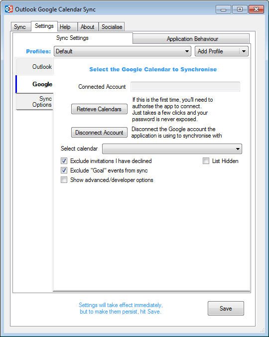



# Google Settings

This is where you configure the Google calendar you wish to sync. 

## Account & Calendar

**Connected Account:** Once OGCS has been authorised to connect to a Google calendar, the associated account will appear here. Donations are associated with this account, where ever OGCS is installed or used.

**Retrieve calendars:** Until clicked, a calendar cannot be selected. If this is the first use of OGCS, it will step through the process of authorising the application to then access the calendars.  

:memo: At no point is the Google account password used or revealed. Technically, a process called OAuth is used - from v2.6.1, once logged into Google, a special authentication code will automatically be provided to OGCS. In earlier versions, a code needed to be manually copy and pasted in to OGCS.
{: .tip}

:warning: If any other third party software required entry of a Google password directly into the application, it is strongly recommended you change your password immediately.
{: .tip}

**Disconnect Account:** To go through the authentication process again, or change the Google account previously configured for OGCS to work with, then click this button.

**Revoke Access:** To revoke authorisation from OGCS continuing to access a Google account. Alternatively, navigate to [https://myaccount.google.com/permissions](https://myaccount.google.com/permissions), click on `Outlook Google Calendar Sync` and then `Remove Access`.

**Select calendar:** Once successfully authenticated, choose the calendar to sync with.  

## Sync Configuration

### Filtering

**Filter colours:** Restrict the items to be synced by either excluding or including various colours that have been assigned to calendar events. Your selection will automatically invert which switching between include or exclude. The default is to not exclude anything.  
**Delete synced items if excluded:** By default this is checked and excluded Google calendar items _will_ be deleted from the Outlook calendar if they have previously been synced.  
In some more complex configuratons, it may be desirable to stop this behaviour. For example, two-way syncing an Outlook calendar to Google for family to have visiblity, but needing to mark Google as _Free_ so the calendar is not blocked out and not having that sync back to Outlook. This can be achieved by manually setting the availability, assigning an excluded colour and _not_ deleting items with excluded colours.  

**Exclude invitations I have declined:** Do not sync Google events that have been declined.  
**Exclude "Goal" events from sync:** Do not sync Google _Goals_ (a now [deprecated Google feature](https://support.google.com/calendar/answer/12207659), replaced by _focus time_ for those with work or school accounts)

### Advanced/developer options
This section allows users to utilise their own personal Google API quota. You will need to know the client ID and secret as provided within your [Google developer console](https://console.developers.google.com){: target="_blank"}. Google Plus and Calendar APIs must be enabled for OGCS to work.

:bangbang: Technical details for configuring OAuth client credentials and personal API quota is beyond the scope of OGCS support.
{: .tip}

&nbsp;



&nbsp;

