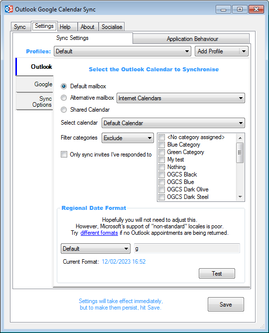

# Outlook Settings

This is where you configure the Outlook calendar you wish to sync. 

### Calendar Store
**Default mailbox:** For most, this is the option you’ll need. It is the default account you have configured in Outlook, with which you most likely send and receive email from.  
**Alternative mailbox:** If you have multiple email accounts configured in Outlook, you may wish to sync a calendar from one which isn’t set as the default account.  
**Shared calendar:** If your Outlook is connecting to an Exchange mailbox and a colleague has shared a calendar with you from an account your don’t own, you may still be able to sync that calendar.

:memo: Depending on the permissions you have been given on the shared calendar, you may only be able to one-way sync meetings from Outlook in to Google.

### Filtering
**Filter categories:** Restrict the items to be synced by either excluding or including various categories that have been assigned to calendar appointments. Your selection will automatically invert which switching between include or exclude. The default is to not exclude anything.

### Date Format
**Regional Date Format:** If OGCS is not finding any Outlook items to sync, even though you know they definitely exist, you will likely need to change this setting. As explained within the application, Microsoft does not appear to support a uniform method by which to translate date text into a date range and then use this to retrieve Outlook calendar items. Unfortunately, this gets worse for non-English locales.  
 

:bulb: In general, the time element causes most problems, with it needing a two digit hour and a two digit minute, separated by a colon (<code class="highlighter-rouge">hh:mm</code>) - i.e. <code class="highlighter-rouge">17:03</code>. 
Often, inclusion of seconds, AM/PM or other separator characters can cause Outlook to find no items.

 
Having altered the date format, check if it returns the correct number of items by clicking the `Test` button.  
  

:memo: If the test returns the correct number of items, but the sync doesn’t, make sure you are not unintentionally <a href="#filtering">excluding items through the category filter</a>.

&nbsp;

