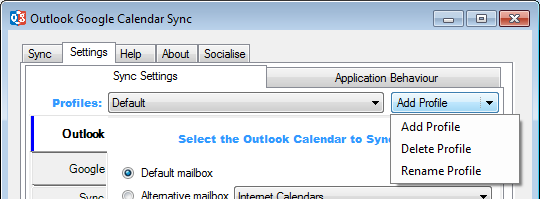



# Settings
 
Use the sub tabs on this screen to configure OGCS to work how you need it to.

Remember the settings do not automatically save and will only persist through a restart of OGCS by clicking the `Save` button.

## Profiles

All of the configuration under the `Sync Settings` tab is assigned to a _Profile_. To sync more than one calendar, each should be configured in their own _Profile_.

&nbsp;



&nbsp;

