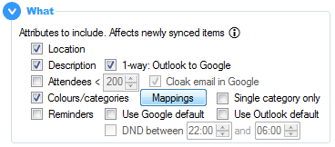
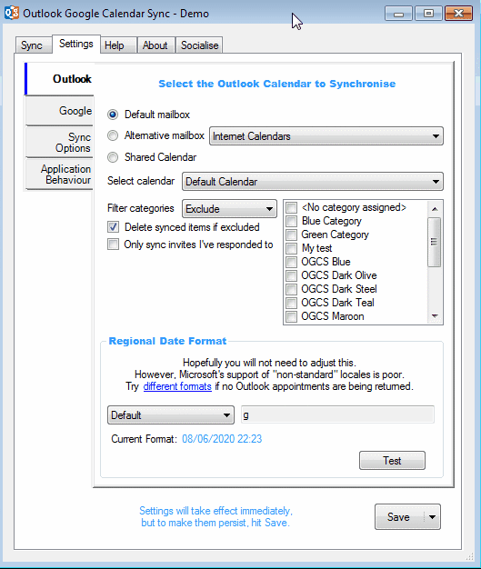
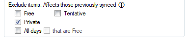



# Sync Options

## What Attributes
_Specify which appointment attributes to include in the sync._

With all of these settings, when turned **on** they will only sync from that point forward. To sync them for all calendar items, press and hold `Shift` while clicking the `Sync` button, or select `Full Sync` from the button drop-down. 

When turning sync **off** data already synced will not be removed - this will need to be done manually and is to protect against loss of data should two-way sync ever be configured.

**Location:** The location of the appointment.

**Description:** The body of the appointment.

<b>One-way to Google:</b> If two-way sync is configured, optionally only sync the description to Google. Because Google has a maximum of 8kb held in plain text, it may cause information or formatting to be lost if subsequently synced back from Google.

**Attendees:** Sync the meeting attendees, using their email address as their unique identifier. A default maximum of 200 attendees can be synced, or specify a lower limit.

:warning:This option is likely to trigger the Outlook security popup. If you cannot prevent this through <a href="{{ site.github-repo }}/wiki/FAQs---Outlook-Security#how-can-i-stop-it-happening">standard settings</a>, it may be best to stop syncing attendees.

<b>Cloak email in Google:</b> Google has been known to <a href="{{ site.github-repo }}/wiki/FAQs#why-are-my-meeting-attendees-getting-notified-of-updates-to-events-in-google">send out unsolicited notification emails</a> to attendees. To prevent this, the default is to “cloak” the attendee’s email address by appending <code class="highlighter-rouge">.ogcs</code>, thus making any such emails undeliverable.

**Colours/categories:** The Outlook category and/or Google colour can be synced, which uses an algorithm to match to the closest equivalent colour. If there are multiple categories in Outlook with the same colour, or the wrong colour is being matched, there are more fine-grained controls under the `Mappings` button.

The <code class="highlighter-rouge">Test map</code> section shows how each colour will map to the other system. It takes into account the table below, which can be used to specify alternative mappings from the default - eg the red Outlook "My Test" category mapped to the "Banana" colour in Google.

<b>Single category only:</b> Google only allows a single colour, so this would enforce only one Outlook category. If unchecked, the sync will create new categories for each synced colour, with a name prefixed by "OGCS ".

**Reminders:** Include reminders/alerts in order to be notified of upcoming meetings. 

<b>Use Google Default:</b> It is possible to configure a default reminder within a Google calendar that all items within it will inherit. Check this option to allow this behaviour to continue when the Outlook item has no reminder set or reminders are not being synced. With the option unchecked, only the Outlook reminder will sync and appear on the Google event, and if none is set in Outlook or reminders are not being synced, Google will not have a reminder either.

<b>Use Outlook Default:</b> It is possible to configure a default reminder within Outlook settings that all items will inherit. Check this option to allow this behaviour to continue when the Google event has no reminder set or reminders are not being synced. With the option unchecked, the Google reminder with the shortice notice period will take precedence and appear on the Outlook appointment, and if none is set in Google or reminders are not being synced, Outlook will not have a reminder either.

<b>DND between hours x and y:</b> Syncing from Outlook to Google is the most popular option, usually in order to see work commitments on an Android phone. For all-day appointments especially, this can mean an unnecessary midnight alert (thanks to the default Microsoft reminder of 15 minutes)! To avoid this, configure a “do not disturb” window in which reminders will not be synced.

### Exclusions
_Specify which calendar items to exclude from the sync._

These settings operating differently according to your sync direction. When calendar items are excluded:
* One-way: both newly created items will be not be synced _and_ previously synced will be removed.
* Two-way: only newly created items will be not be synced to the target calendar.   

If greater control is needed around what should sync, include or excluding [Outlook categories](outlook#filtering) / [Google colours](google#filtering) that are manually assigned to individual items may suit better.

**Availability:** Exclude calendar items marked as _Free_ or _Tentative_. Note that Tentative is only available when syncing from Outlook.  
**Privacy:** Exclude calendar items marked as _Private_.  
**All-Day:** Exclude all-day calendar items, or those spanning several days from midnight to midnight. Optionally, only exclude all-day items that are marked _Free_.  
**Subject that contains:** Exclude any items with subjects/titles that match this search string. Supports [regular expressions](https://www.regular-expressions.info).  

&nbsp;



&nbsp;

