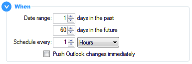



# Sync Options

## When

_Specify when to run a sync._

**Date Range:** Select the number of days into the past and future within which calendar items should be synced. Date ranges greater than a year into the past or future are not allowed. 

If a recurring appointment spans the date range specified, then it will also be synced, although only _exceptions_ to the series that fall within the date range will be updated. A minor divergence to this are annual recurrence patterns - these will only sync if the month of the appointment falls into a month within the sync date range.

:bulb: To optimise the sync speed, the smaller the date range the better. Try to avoid a large date range combined with a frequent sync interval.

 

**Schedule:** The number of hours or minutes between automated syncs. 
Setting it to zero turns off automated syncs, relying upon on-demand manual synchronisations.  
15 minutes is the minimum sync frequency allowed, unless Push Sync is _also_ enabled in which case it is 120 minutes.  

**Push Outlook Changes Immediately:** Have OGCS detect when calendar items are changed within Outlook and sync them within 2 minutes.

&nbsp;



&nbsp;

