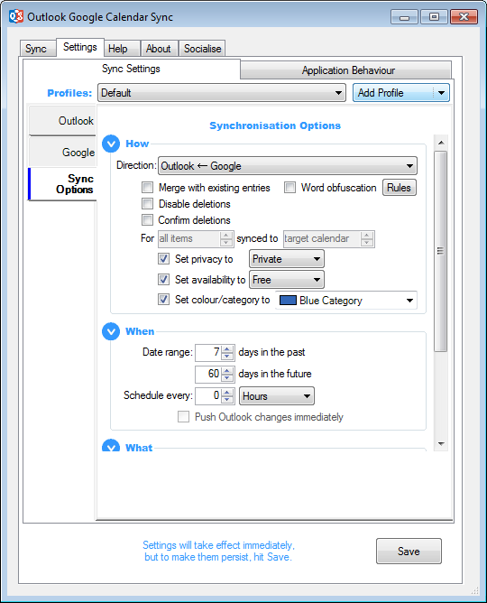
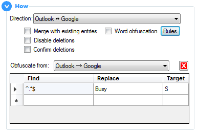
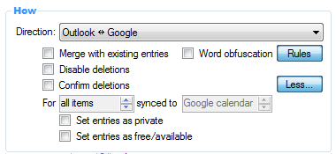



# Sync Options

This is where you configure **[how](#how), [when](#when)** and **[what](#what)** is synced between your calendars.

## How
**Direction:** One-way sync from Outlook to Google, vice versa or two-way sync between both.

These next configuration items help you manage what should happen with items that OGCS wants to remove.

**Merge with existing entries:** It is recommended the target calendar is either empty or a new calendar created specifically for OGCS to sync with. This will make it easier for you to identify what has been synced etc. However, if you need to sync into a calendar that contains items not present in the source calendar and you want to keep those items, check this option. 

:bulb: Such a situation may arise if you wish to sync your work Outlook calendar in to the default Google calendar, in order that Alexa or Google Home can announce your schedule for the day.

**Disable deletions:** This option is mostly a safeguard to be used by new users of OGCS. Once you have confidence the tool is working as expected, it should most likely be switched off.  
**Confirm deletions:** Once deletions have been permitted, if you turn this option on, each deletion will prompt you to confirm or deny if this should be allowed. Again, this is to help you gain confidence you have the right configuration and OGCS is doing what you expect. It is not intended as a setting to have enabled long term.

**Word obfuscation:** Through the use of [regular expressions](https://www.regular-expressions.info), certain letters, words or phrases in the calendar item’s subject can be altered. By clicking the `Rules` button, you will see a table with `Find` and `Replace` columns; each row of regular expression rules would be applied in the order given using AND logic.

:memo: If two-way sync is configured, the obfuscation can only work in one direction - choose which from the drop down menu.

 

**More:** Click the button to expand the section for further options. The button text will change to `Less`, which if clicked will shrink the section back to its original size.

The following options override the item’s attribute when synced to the target calendar.
<ul style="margin-top:-20px; margin-left:20px">
  <li>Set as private</li>
  <li>Set as free/available</li>
</ul>
For two-way sync, you can choose between Outlook and Google as to which is the target calendar, as well as whether to implement the override
<ul style="margin-top:-20px; margin-left:20px">
  <li>For all synced items; or</li>
  <li>Only for items newly created by the sync tool</li>
</ul>

## When

_Specify when to run a sync._

**Date Range:** Select the number of days into the past and future within which calendar items should be synced. Date ranges greater than a year into the past or future are not allowed. 
If a recurring appointment spans the date range specified, then it will also be synced. A minor exception to this are annual recurrence patterns - these will only sync if the month of the appointment falls into a month within the sync date range.

:bulb: To optimise the sync speed, the smaller the date range the better. Try to avoid a large date range combined with a frequent sync interval.

**Interval:** The number of hours or minutes between automated syncs. 
Setting it to zero turns off automated syncs, relying upon on-demand manual synchronisations.  
15 minutes is the minimum sync frequency allowed, unless Push Sync is _also_ enabled in which case it is 120 minutes.  
**Push Outlook Changes Immediately:** Have OGCS detect when calendar items are changed within Outlook and sync them within 2 minutes.

## What

_Specify which attributes to include in the sync._

With all of these settings, when turned **on** they will only sync from that point forward. To sync them for all calendar items, press and hold `Shift` while clicking the `Sync` button. When turning sync **off** data already synced will not be removed - this will need to be done manually and is to protect against loss of data should two-way sync ever be configured.

**Description:** The body of the appointment.

<b>One-way to Google:</b> If two-way sync is configured, optionally only sync the description to Google. Because has a maximum of 8kb held in plain text, it may cause information or formatting to be lost if subsequently synced back from Google.

**Attendees:** Sync the meeting attendees, using their email address as their unique identifier. 

:warning:This option is likely to trigger the Outlook security popup. If you cannot prevent this through <a href="https://github.com/phw198/outlookgooglecalendarsync/wiki/FAQs---Outlook-Security#how-can-i-stop-it-happening">standard settings</a>, it may be best to stop syncing attendees.

<b>Cloak email in Google:</b> Google has been known to <a href="https://github.com/phw198/outlookgooglecalendarsync/wiki/FAQs#why-are-my-meeting-attendees-getting-notified-of-updates-to-events-in-google">send out unsolicited notification emails</a> to attendees. To prevent this, the default is to “cloak” the attendee’s email address by appending <code class="highlighter-rouge">.ogcs</code>, thus making any such emails undeliverable.

**Reminders:** Include reminders/alerts in order to be notified of upcoming meetings. 

<b>Use Google Default:</b> It is possible to configure a default reminder within a Google calendar that all items within it will inherit. Check this option to allow this behaviour to continue; otherwise the Outlook reminder will take precedence - and if none is set, Google will not have a reminder either.

<b>DND between hours x and y:</b> Syncing from Outlook to Google is the most popular option, usually in order to see work commitments on an Android phone. For all-day appointments especially, this can mean an unnecessary midnight alert (thanks to the default Microsoft reminder of 15 minutes)! To avoid this, configure a “do not disturb” window in which reminders will not be synced.

&nbsp;



&nbsp;

