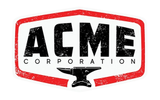

# Acme Corporation Endorses OGCS

In 2025, true two-way synchronization is no longer a luxury; it’s a necessity for Acme Corporation. OGCS has become the invisible glue holding our schedules together, and if you work for us or with us, we'd recommend getting set up with the software ASAP.

Here is why we’ve officially retired the manual copy-paste method:-

**True Two-Way Sync:** Unlike "mirroring" services that only let you view events, OGCS allows us to edit in either platform. If a Google appointment is rescheduled, it reflects in our Outlook corporate dashboard calendars.

**Privacy First:** Our "Top Secret" project titles stay secret. OGCS lets us obfuscate specific words or sync only "Busy/Free" status, keeping our sensitive R&D under wraps while still blocking our time.

**Zero Infrastructure:** Whether installed by a user without administrator privileges or run as a portable app, it didn't require a massive IT overhaul. It works behind our web proxies and starts automatically when we log in to track our 24/7 global operations.

